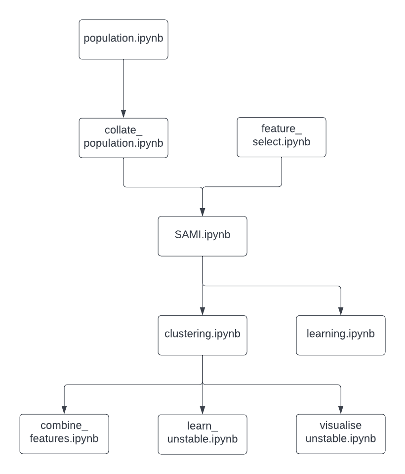

# forcasting-urban-indicators

Included are all the original and derived datasets, and the code to generate and analyse these datasets. The original data can be found at https://www.bls.gov/cew/downloadable-data-files.htm in the By Area Quarterly column for the base urban indicators and https://www.census.gov/data/datasets/time-series/demo/popest/2010s-counties-total.html and https://www.census.gov/data/tables/time-series/demo/popest/intercensal-2000-2010-counties.html for population. 

The order in which to run the code can be seen in the following diagram
